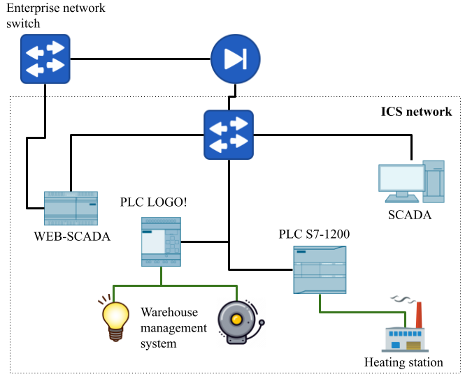

# frostyICS &#127981;
Industrial control system cyber range with objective to disrupt heating system.

# General

# Structure

# Requirements

## Hardware

| Element                                       | Description                                                |
| --------------------------------------------- | ---------------------------------------------------------- |
| PLC - s71200                                  | mlfb and links and alternative mlfbs (Link to uni package) |
| PLC - LOGO! 8.2                               | mlfb and link (Link to uni package)                        |
| webSCADA - industrial PC - iot2040 or iot2050 | mlfb and link                                              |

## Software

| ..                       | Description                                                  |
| ------------------------ | ------------------------------------------------------------ |
| TIA portal V15 or higher | link for trial (MLFB) link for university package            |
| LOGO! Softcomfort        | link + mlfb (link to trial but cant upload to logo). Link for university package |
| NodeRed                  | link to node red                                             |
| Windows 7 or higher      | Can be as main operation system or as wirtual machine. I suggest using two diferent Win machines, one as SCADA machine for actual network and second as enginering station. Bouth will contain TIA portal but it will be simpler to deploy everithing. |

# Installation

-  SCADA Windows installation + tiaportal installation + importing project in to tiaportal
- Enginering station for configuring PLCs - tiaportal install + logo aoftcomfort install
- 1200 config - project importing + adjustment like IP etc
- Logo same instr
- Industrial PC - yocta install for siemens link where to find + nodeder install + importing the program

More information:   [installation.md](./doc/installation.md) 

TIA portal usage:  [TIA_portal_explained.md](doc\TIA_portal_explained.md) 

LOGO! SoftComfort usage:  [LOGO!_SoftComfort_explained.md](doc\LOGO!_SoftComfort_explained.md) 

# Attack scenarios

Idea is that attacker is outside of the network 

Owerview

- Compromisin ICS perimiter, gain acces to web SCADA
- Modbus attacks
- S7comm attacks links uz vairāk info un poc

 [attacks.md](/doc/attacks.md) 

# Future work