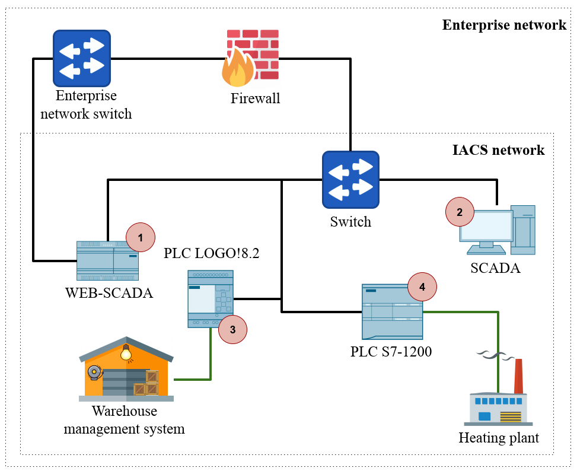
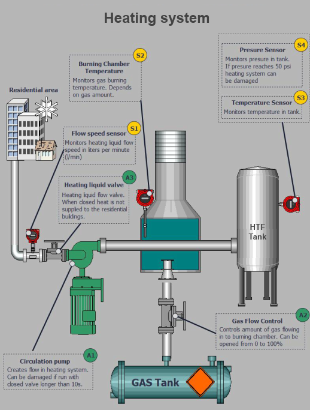
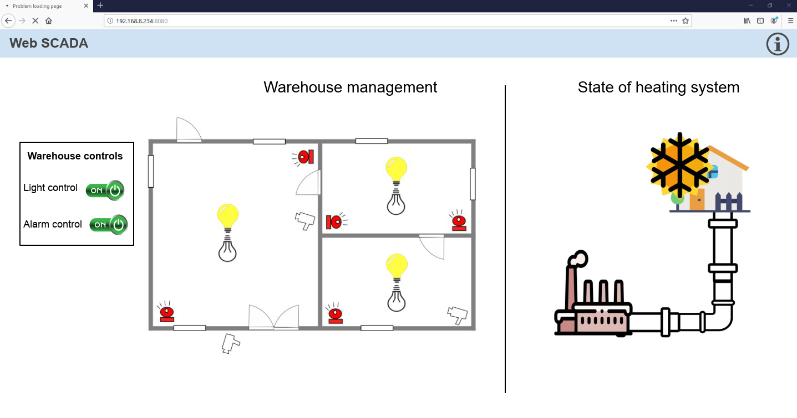

# frostyICS &#127981;
Industrial control system cyber range with objective to disrupt heating system.

# TL;DR

No shortcuts

# Topology

Cyber range network topology is shown bellow. System consists of two PLC's, SCADA and WEB-SCADA. So  CR can be divided in to control and execution sections. Control section contains SCADA and execution contains PLC's. For PLC S7-1200 in CR hardware-in-the-loop (HIL) is used to simulate heating process. HIL consists of simplified mathematics model of the physical heating process. HIL includes and controls nominal values of physical process so that process can be damages if nominal values are exceeded. For PLC LOGO! there is no complex physical process to simulate as the PLC LOGO! controls state of lights and alarm.

For operator to visualize and interact with process SCADAS are used in this case. SCADA can be used also for attacker to understand the state and purpose of the system. Heating process is visualized using WinCC SCADA. WinCC is the run-time of the SCADA program and can be created in TIA portal. WinCC is computer software hence can be run in Windows virtualized environment making it easier to reproduce and expand. Windows can also increase attack surface of the CR. Also SCADA and engineering software for most of the vendors can be downloaded and used for trail period which is financially favorable solution.

The SCADA and PLC S7-1200 was configured and programmed utilizing Siemens software TIA Portal. The TIA Portal is a multipurpose platform which allows to program the PLC's and other peripheral devices like networking elements, HMI's, SCADA. TIA Portal allows fully functional simulation and emulation of the programmed environment. TIA Portal allows to access the devices online. It also allows the user to access the diagnostics functionality embedded in the devices in real time.

# Working principle

## Heating system

Logic and Heating process simulation is on S7-1200 PLC and visualization are in SCADA.

SCADA HMI visualization of the heating plant is shown bellow. The heating plant consists of:

- Heating transmission line - transports \gls*{htf} to the city;
- Circulation pump (A1) - forces the HTF flow to the city;
- Transmission line valve (A3) - required to be open for the \gls*{htf} to circulate;
- Gas flow valve (A2) - control the burning temperature of the gas in the burning chamber;
- Temperature and pressure sensors (S3, S4) - to monitor and give feedback to the control system about temperature and pressure in HTF tank;
- Flow speed sensor (S1) - To monitor and give feedback to the control system about the state of the HTF flow speed.
- 

The heating process can be divided into two phases. One of the phases is the heating of HTF, and the second is HTF transmission to the city districts:

- HTF is heated by burning gas in the furnace. Then the heated fluid is distributed to the rural area. Gas flow is related to the burning temperature. Burning temperature is controlled by gas flow valve A2. To automate the burning process, an operator sets a setpoint with the desired fluid temperature level. S7-1200 PLC compares setpoint temperature with the actual heat transfer fluid temperature S4. Based on that, S7-1200 PLC controls gas-burning temperature S2  by adjusting gas flow controller A2. This system has embedded physical limits, such as, maximum temperature and maximum pressure. After exceeding maximum values, the heating plant gets damaged. If temperature or pressure values reach a set threshold, S7-1200 automation protects  the physical system by stopping the gas flow to safeguard against the damage;
	
- The HTF transmission process depends on the heating process. When HTF in the transmission line reaches temperature 60° C, then circulation pump A1 switches on, and heating valve A3 opens. In this phase heating system is fully operational, and heat is delivered to the city districts. However, this part of the system can be damaged irreversibly if the circulation pump runs with the heating liquid valve (A3) closed.

## Warehouse management system

Logic of warehouse management runs on LOGO! and visualization resides on WEB-SCADA

<table>
<thead>
  <tr>
    <th>Nr.</th>
    <th>Element</th>
    <th>System description</th>
    <th>MLFB order code</th>
  </tr>
</thead>
<tbody>
  <tr>
    <td rowspan="3">1</td>
    <td rowspan="3">SCADA</td>
    <td>Siemens, SIMATIC WinCC Advanced&nbsp;&nbsp;&nbsp;V15.1</td>
    <td>6AV2102-0AA05-0AA5 </td>
  </tr>
  <tr>
    <td>Windows&nbsp;&nbsp;&nbsp;7 enterprise, SP1, Build 7601</td>
    <td>n/a</td>
  </tr>
  <tr>
    <td>VirtualBox&nbsp;&nbsp;&nbsp;V6.0</td>
    <td>n/a</td>
  </tr>
  <tr>
    <td rowspan="3">2</td>
    <td rowspan="3">WEB-SCADA</td>
    <td>NodeRed V1.0.0 \footnote{NodeRED&nbsp;&nbsp;&nbsp;- Low-code programming platform for event-driven applications&nbsp;&nbsp;&nbsp;\href{https://nodered.org/}{https://nodered.org/} }</td>
    <td>n/a</td>
  </tr>
  <tr>
    <td>Yocta&nbsp;&nbsp;&nbsp;Linux V2.6</td>
    <td>n/a</td>
  </tr>
  <tr>
    <td>IOT2040</td>
    <td>6ES7647-0AA00-1YA2</td>
  </tr>
  <tr>
    <td>2</td>
    <td>PLC LOGO!</td>
    <td>Siemens, LOGO! 8.2, Full&nbsp;&nbsp;&nbsp;versions: 1.82.02</td>
    <td>6ED1052-1FB08-0BA0</td>
  </tr>
  <tr>
    <td>3</td>
    <td>PLC s7-1200</td>
    <td>Siemens, SIMATIC S7-1200, CPU&nbsp;&nbsp;&nbsp;1215C</td>
    <td>6ES7215-1AG40-0XB0</td>
  </tr>
</tbody>
</table>

Warehouse management in this CR is used to control alarms and lights. This process is much simpler than the heating plant. Siemens LOGO! 8.2 PLC is used to control it as it is meant for simple applications. LOGO! can have different configurations depending on added functional modules. In this CR LOGO! 8.2 basic module is used with built-in I/O and communication interface.

# Requirements

## Hardware

Following are hardware required to set up the lab. Additionally alternatives for each device are briefly described. To check device parameters and search for MLFB codes SIemens SIOS siste can be used https://support.industry.siemens.com/ .

## Software

Following software requirements are listed in table bellow:

| Software                 | Description                                                  |
| ------------------------ | ------------------------------------------------------------ |
| TIA portal V15 or higher | For trial period can be downloaded from here https://support.industry.siemens.com/cs/document/109761045/simatic-step-7-and-wincc-v15-1-trial-download . This is link for 15.1 version, project version should match with TIAportal version. It is important to note that to get this trial can take up to several day as registration to Siemens site takes some time |
| LOGO! Softcomfort        | LOGO! soft comfort has trial, however it doesn't has capability to upload project to PLC https://new.siemens.com/global/en/products/automation/systems/industrial/plc/logo/logo-software.html#Demosoftware. Full version can be bought. Unfortunately currently software can be bought in CD and cant be downloaded. You should consult with Siemens representatives in your country. This software is relatively cheep, you could cut on some bears and you will have this software :) |
| NodeRed                  | https://nodered.org/                                         |
| Windows 7 or higher      | Can be as main operation system or as virtual machine. I suggest using two different Win machines, one as SCADA machine for actual network and second as engineering station. Both will contain TIA portal but it will be simpler to deploy everything. |

# Installation and project uploading

- TiaPortal v15 and v16 software installation and project uploading is explained here   [TIAportal installation](./doc/tia-portal-installation.md) 
- TIAportal usage are described here  [youtube](https://www.youtube.com/watch?v=GgKMGj0aXQw) 
- LOGO! Soft Comfort installation and project upload is described here [LOGO installation](./doc/logo-project-installation.md)
- LOGO! SoftComfort usage are best explained here:  [Youtube playlist](https://www.youtube.com/watch?v=xbK3ngp70hM&list=PLRtRKudOMmtFVIVcH0AMX4h9rszwDPXEE) 

