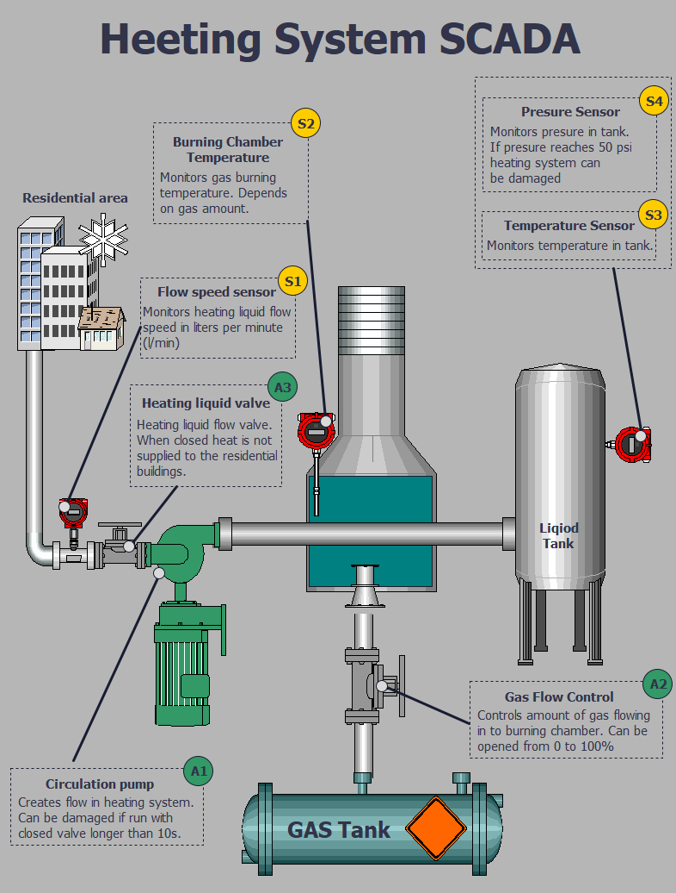
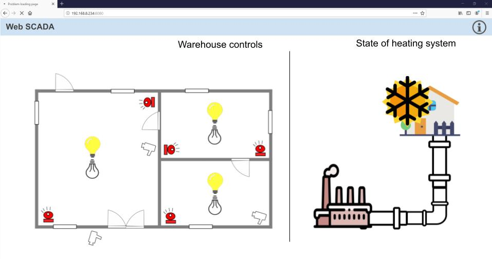

# frostyICS &#127981;
Industrial control system cyber range with objective to disrupt heating system.

# General

# Topology

Cyber range network topology is shown in bellow. System consists of two PLC's, SCADA and WEB-SCADA. So  CR can be divided in to control and execution sections. Control section contains SCADA and execution contains PLC's. For PLC S7-1200 in CR hardware-in-the-loop (HIL) is used to simulate heating process. HIL consists of simplified mathematics model of the physical heating process. HIL includes and controls nominal values of physical process so that process can be damages if nominal values are exceeded. For PLC LOGO! there is no complex physical process to simulate as the PLC LOGO! controls state of lights and alarm.

For operator to visualize and interact with process SCADAS are used in this case. SCADA can be used also for attacker to understand the state and purpose of the system. Heating process is visualized using WinCC SCADA. WinCC is the run-time of the SCADA program and can be created in TIA portal. WinCC is computer software hence can be run in Windows virtualized environment making it easier to reproduce and expand. Windows can also increase attack surface of the CR. Also SCADA and engineering software for most of the vendors can be downloaded and used for trail period which is financially favorable solution.

The SCADA and PLC S7-1200 was configured and programmed utilizing Siemens software TIA Portal. The TIA Portal is a multipurpose platform which allows to program the PLC's and other peripheral devices like networking elements, HMI's, SCADA. TIA Portal allows fully functional simulation and emulation of the programmed environment. TIA Portal allows to access the devices online. It also allows the user to access the diagnostics functionality embedded in the devices in real time.

# Working principle

## Heating system

Visualization of heating system as seen in SCADA is displayed below. Heating system consist mainly heating transmission line, circulation pump (A1) responsible for heated liquid circulation, transmission line valve (A3) required to be open for liquid to circulate, gas flow valve (A2) to control gas burning temperature and burning chamber. Additionally system contains sensors to monitor state of physical state like temperature and pressure sensors (S3, S4) and flow speed sensor (S1) 

Heating of the liquid is done by burning gas in furnace and then it is distributed to rural area. When transmission liquid reaches temperature 60 C° then circulation pump is switched on and heating valve is opened. In this phase heating system is fully operational. Created system can be damaged if circulation pump runs with heating liquid valve closed and if transmission line is over heated without circulation pump running and heating valve is closed. In that case pressure rises to nominal value making liquid tank to rapture.

## Warehouse management system

WEB-SCADA are also used to control processes however it is simpler and easier to implement than WinCC SCADA. WEB-SCADA runs on IOT2040 (Siemens industrial PC) hardware and Yocta Linux. Purpose of this device in the network is to visualize and provide control for warehouse. WEB SCADA interface can control lights and alarm systems in warehouse and display state of the heating system. Information exchange about lights, alarms and heating system state is with PLC LOGO! using ModBus protocol.

# Requirements

## Hardware

Following are hardware required to set up the lab. Additionally alternatives for each device are briefly described. To check device parameters and search for MLFB codes SIemens SIOS siste can be used https://support.industry.siemens.com/ .

| Element                                       | Reference code (mlfb) | Alternatives                                                 |
| --------------------------------------------- | --------------------- | ------------------------------------------------------------ |
| PLC - s71200                                  | 6ES5 215-1AG40-0XB0   | Any s7-1200 as i/o numbers are not important for this project |
| PLC - LOGO! 8.2                               | 6ED1052-1FB08-08A0    | Any LOGO! are suitable to run program in this project, however hardware vulnerabilities can be already fixed. If using LOGO!8.3 it contains TLS security layer for communication with engineering station. |
| webSCADA - industrial PC - iot2040 or iot2050 | 6ES7 647-0AA00-1YA2   | Iot2040 is discontinued, instead iot2050 can be used. As this industrial pc runs general purpose software on Yocta Linux it is possible substitute it for virtualized Linux. |

## Software

Following software requirements are listed in table bellow:

| Software                 | Description                                                  |
| ------------------------ | ------------------------------------------------------------ |
| TIA portal V15 or higher | For trial period can be downloaded from here https://support.industry.siemens.com/cs/document/109761045/simatic-step-7-and-wincc-v15-1-trial-download . This is link for 15.1 version, project version should match with TIAportal version. It is important to note that to get this trial can take up to several day as registration to Siemens site takes some time |
| LOGO! Softcomfort        | LOGO! soft comfort has trial, however it doesn't has capability to upload project to PLC. Full version can be bought. Unfortunately currently software can be bought in CD and cant be downloaded. You should consult with Siemens representatives in your country. This software is relatively cheep, you could cut on some bears and you will have this software :) |
| NodeRed                  | https://nodered.org/                                         |
| Windows 7 or higher      | Can be as main operation system or as virtual machine. I suggest using two different Win machines, one as SCADA machine for actual network and second as engineering station. Both will contain TIA portal but it will be simpler to deploy everything. |

# Installation

-  SCADA Windows installation + tiaportal installation + importing project in to tiaportal
- Enginering station for configuring PLCs - tiaportal install + logo aoftcomfort install
- 1200 config - project importing + adjustment like IP etc
- Logo same instr
- Industrial PC - yocta install for siemens link where to find + nodeder install + importing the program

More information:   [installation.md](./doc/installation.md) 

TIA portal usage:  [TIA_portal_explained.md](doc\TIA_portal_explained.md) 

LOGO! SoftComfort usage:  [LOGO!_SoftComfort_explained.md](doc\LOGO!_SoftComfort_explained.md) 

# Attack scenarios

Idea is that attacker is outside of the network 

Owerview

- Compromisin ICS perimiter, gain acces to web SCADA
- Modbus attacks
- S7comm attacks links uz vairāk info un poc

## Introdeuced vulnerabilities and misconfigurations

 [attacks.md](/doc/attacks.md) 

