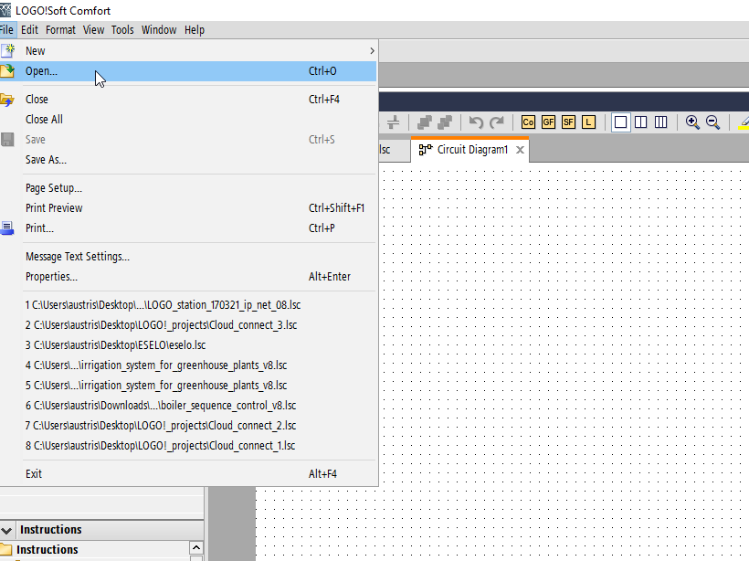
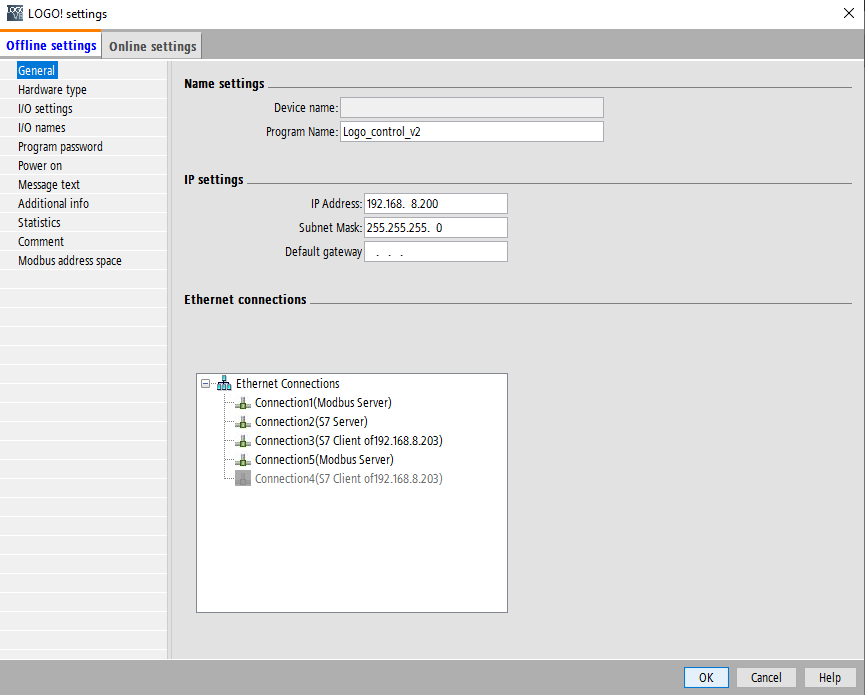
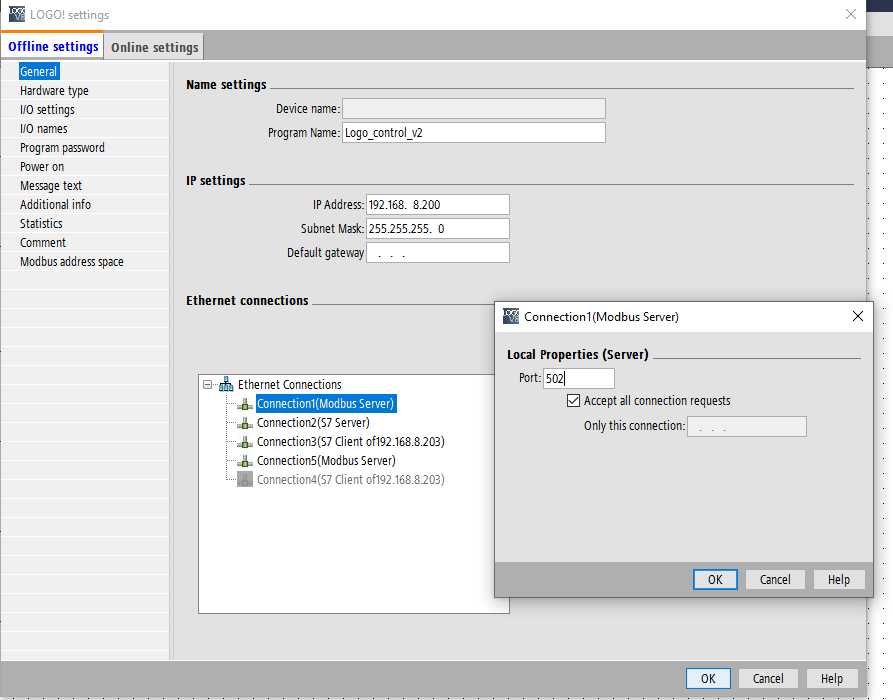
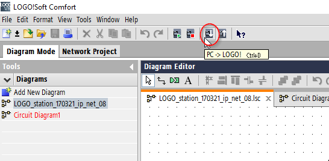
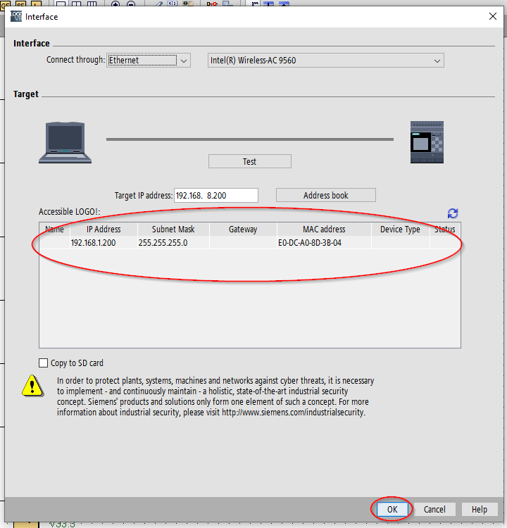

# LOGO Soft comfort installation

This software is installed as any tipical application on windows machine. Nothing specific to tell here

# Unloading configuration to PLC (LOGO!)

Opening project

Changing apropriate IP address to match subnet if necesary:

If IP is changed ModBus and S7 partner devices need to be updated:

Modbus configuration

S7 configuration:

Uploading project to the  PLC:

Before uploading Soft Comfort will ask to search for device and choose to which of available devices to upload the project:

When project is downloaded to device you can see LOGO parameters on LOGO display and do some simple adjustments.

To debug the program if any changes are made can be done using built in tools. Online test allows to connect to PLC and check the status of program in the PLC

