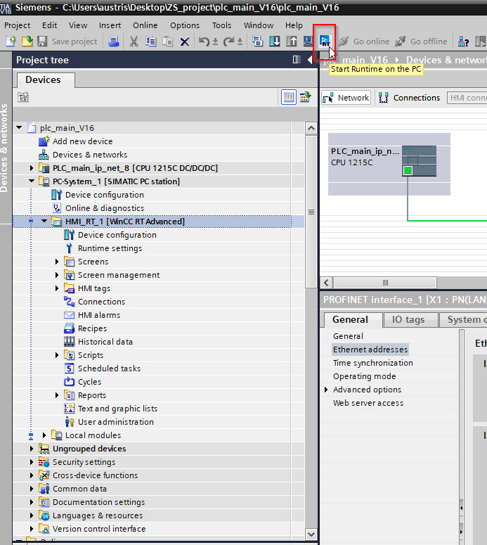
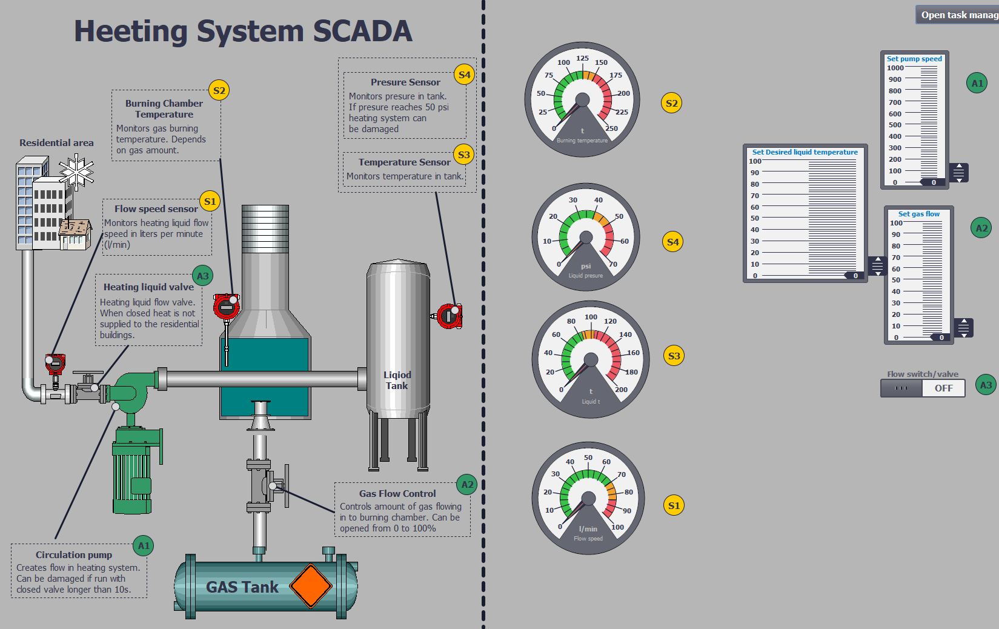

# Starting winCC SCADA

Check  [tia-portal-installation.md.md](tia-portal-installation.md.md) for instruction how to import the project.

After configuration of IP ranges wincc runtime can be started.

WinCC starts and automatically connects to 1200

