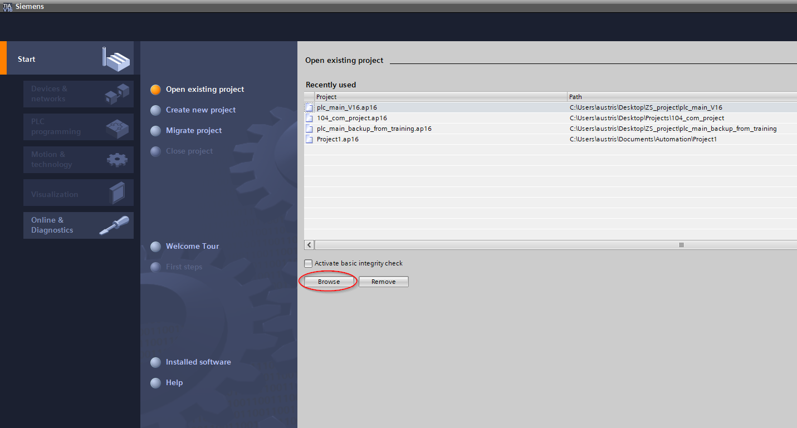
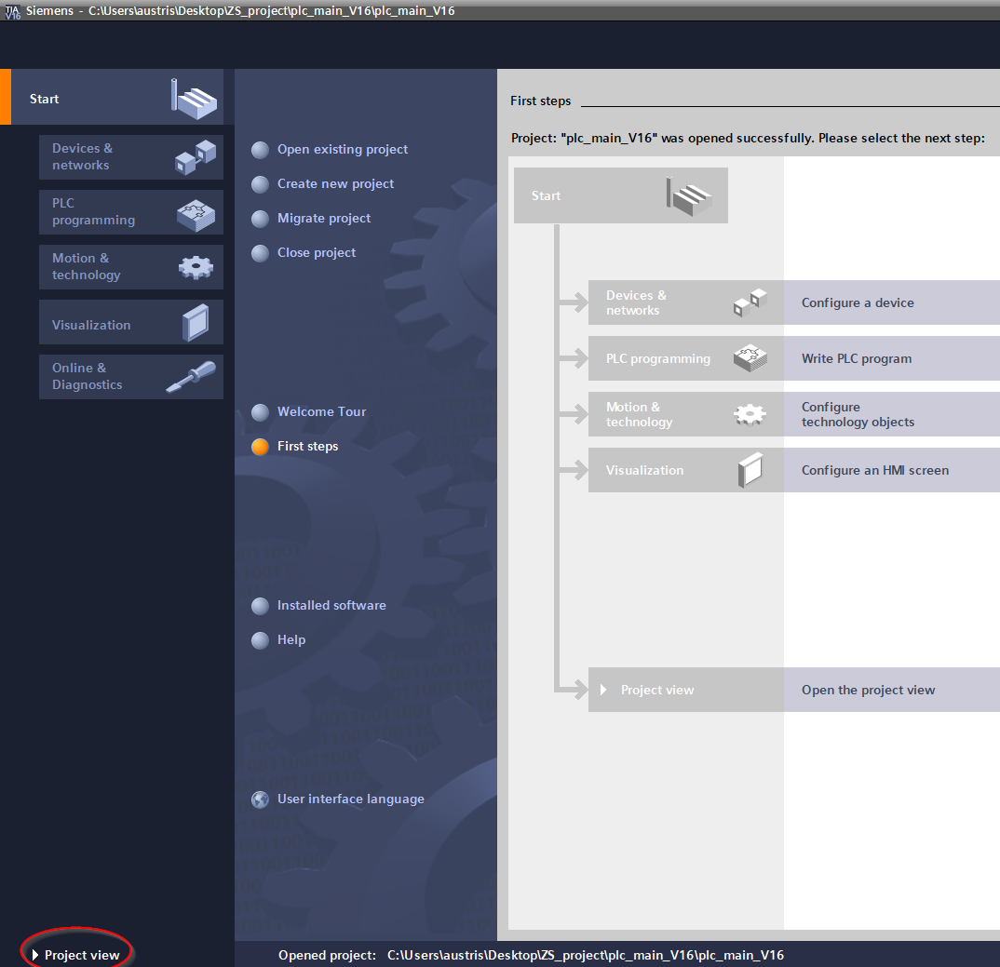
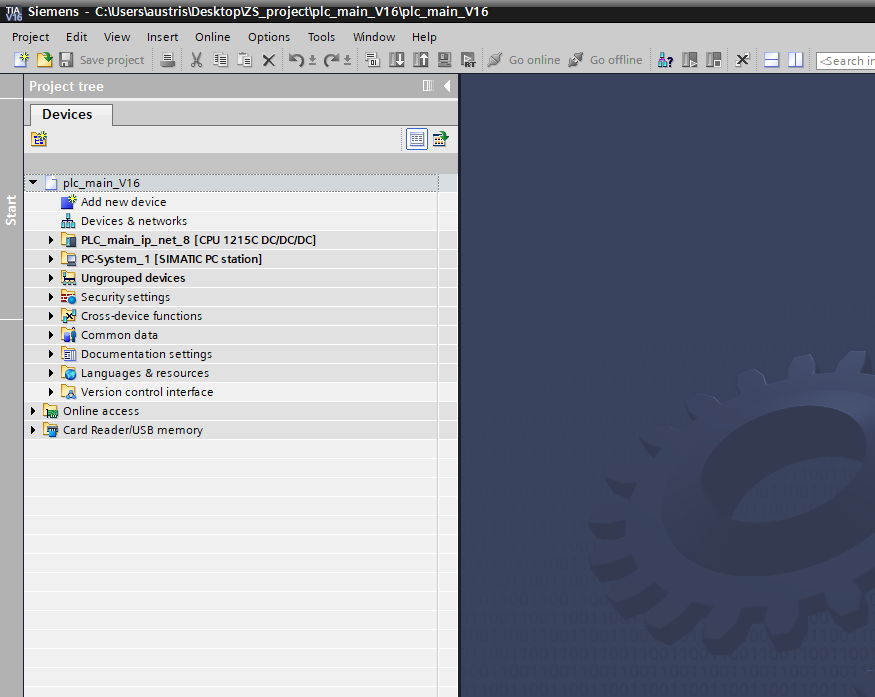
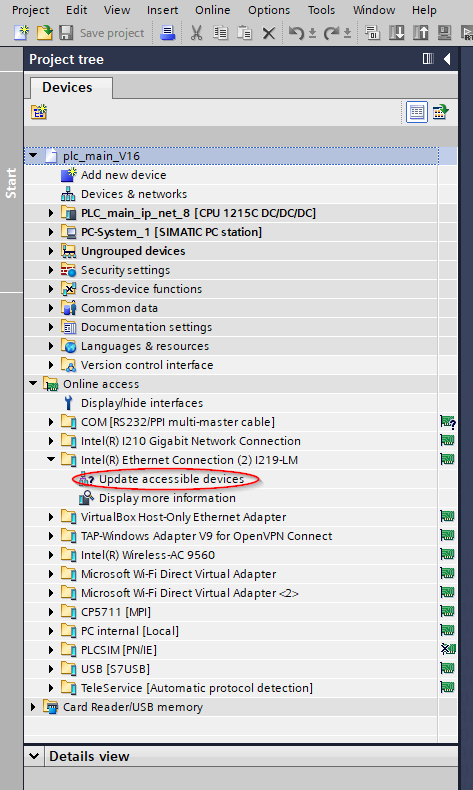
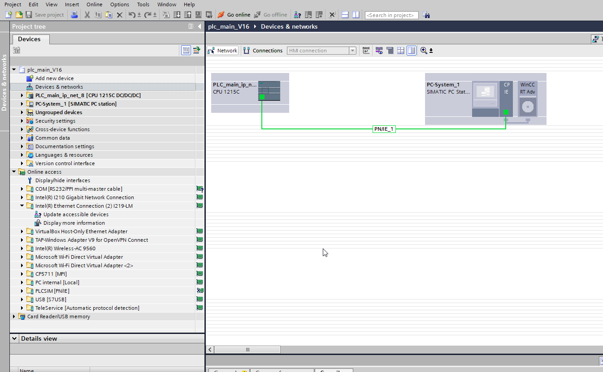
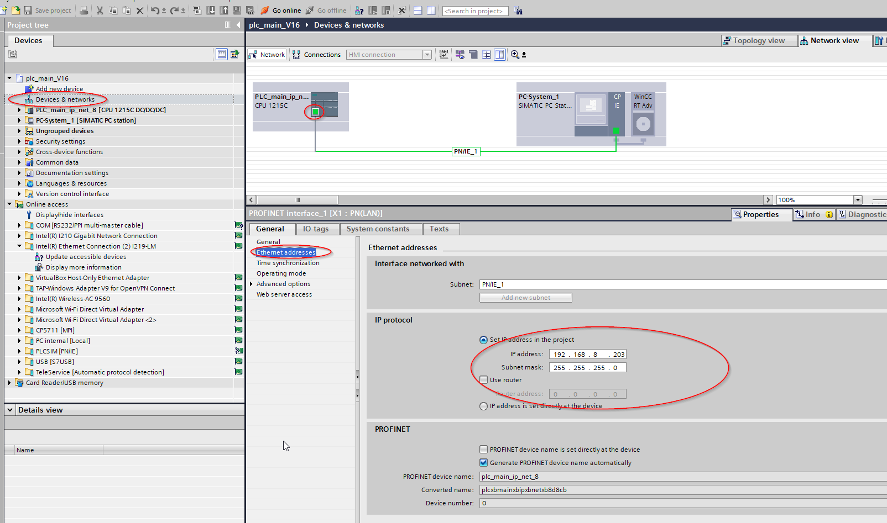
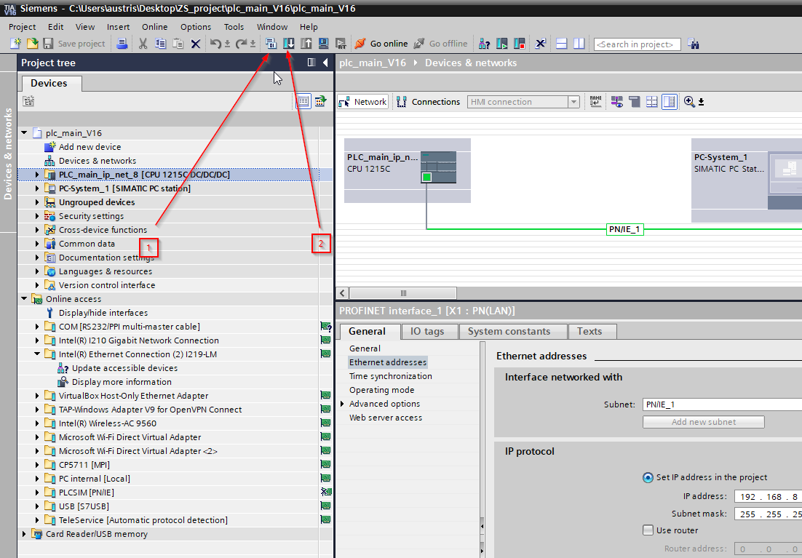
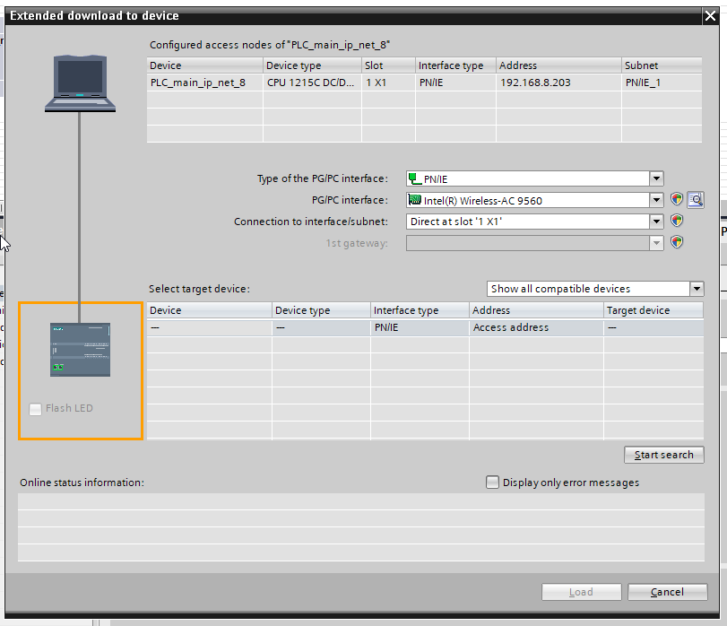

#  TIA portal installation proces

Installation process is similar as any windows application, it usualy is straigth forward. Trobles can appear if some new updates are installed on windows.

# Uploading project to PLC

Before uploading compile to see if there is no errors. then download to PLC

Chose interface etc and search. When search completes select the device and upload the project.

